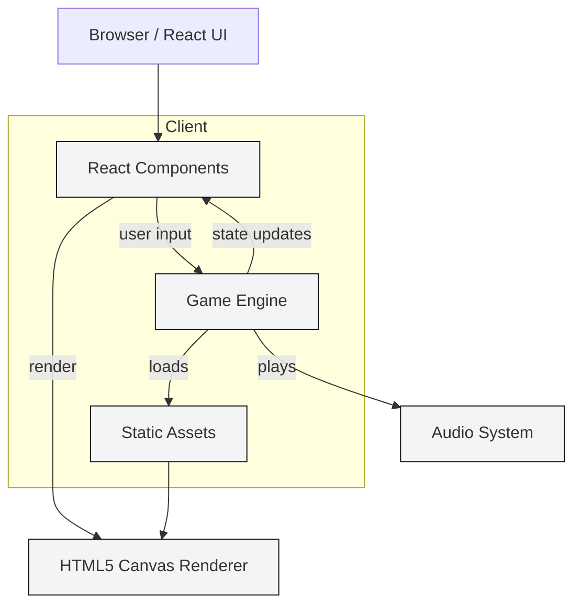

# Pixel RPG Adventure

An modular 2D pixel-art RPG built with React, TypeScript and Vite.

**Project category:** Game / Frontend — Single-page application (HTML5 Canvas + React)

## Table of Contents

- [Overview](#overview)
- [Objectives](#objectives)
- [Project Structure](#project-structure)
- [Architecture](#architecture)
- [Technology Stack](#technology-stack)
- [Local Development](#local-development)
- [Configuration](#configuration)
- [Building & Deployment](#building--deployment)
- [Contributing](#contributing)
- [License](#license)

## Overview

Pixel RPG Adventure is a small, extensible 2D RPG demo focusing on a modular game engine, episode-based story scripting, inventory/shops, and a lightweight HUD. It's intended as a base for rapid prototyping and teaching core game systems.

## Objectives

- Provide a compact, production-minded codebase for a browser RPG.
- Keep engine logic separated from UI and episode content.
- Make the project easy to run, extend, and ship.

## Project Structure

- `index.html` — App entry HTML
- `package.json` — Node scripts and dependencies
- `tsconfig.json`, `vite.config.ts` — TypeScript & Vite configuration
- `src/` — Main application source
   - `main.tsx`, `App.tsx` — React entry and routing
   - `index.css` — Global styles
   - `types.ts` — Shared TypeScript types
   - `components/` — React UI components (HUD, Inventory, Dialogue, Shop, Character selection)
- `engine/` — Core game engine modules (map, rpgSystem, sound, sprites)
- `episodes/` — Episode-specific content and story scripts
- `assets/` — Images, spritesheets, audio

## Architecture

The app is a client-side SPA that separates UI, engine logic, and episode content. The following diagram summarizes the components and data flow.



Component interactions (concise):

- `React Components`: Handle UI, menus, input capture and dispatch to the engine.
- `Game Engine` (`engine/`): Maintains game state, runs update loops, processes collisions, quests, inventory and dialogue logic.
- `Assets`: Image and audio files loaded by the engine at runtime.
- `Canvas Renderer`: Receives draw commands from the engine and renders to the HTML5 Canvas.
- `Sound`: Lightweight audio wrapper that plays music and effects.

## Technology Stack

- 🟢 Node.js — Runtime for tooling and local dev
- 🔷 TypeScript — Language and type safety
- ⚛️ React — UI framework
- ⚡ Vite — Dev server and bundler
- 🎨 CSS / HTML5 Canvas — Rendering and styles
- 📦 NPM — Package manager

## Local Development

Prerequisites

- Node.js 18+ and npm

Clone and install

```bash
git clone <your-repo-url>
cd rpg-pixel
npm install
```

Start development server

```bash
npm run dev
# Dev server runs on http://localhost:3000 by default
```

Run static type check

```bash
npm run lint
```

Build for production

```bash
npm run build
```

Preview production build

```bash
npm run preview
```

## Configuration

- Environment variables (development):

- `APP_URL` — Optional: the public app URL used for self-referential links.

Create a local env file if you need to provide `APP_URL`:

```bash
# .env.local (not committed)
APP_URL="http://localhost:3000"
```

No external AI credentials are required by this project.

## Building & Deployment

This project outputs a static build via Vite. Deploy the contents of `dist/` to any static hosting provider (Netlify, Vercel, GitHub Pages, or a static S3 bucket behind a CDN).

## Contributing

- Open issues for bugs or feature requests.
- Keep changes focused and add tests where applicable.

## License

This project is provided as-is. Add your preferred license file if publishing.

